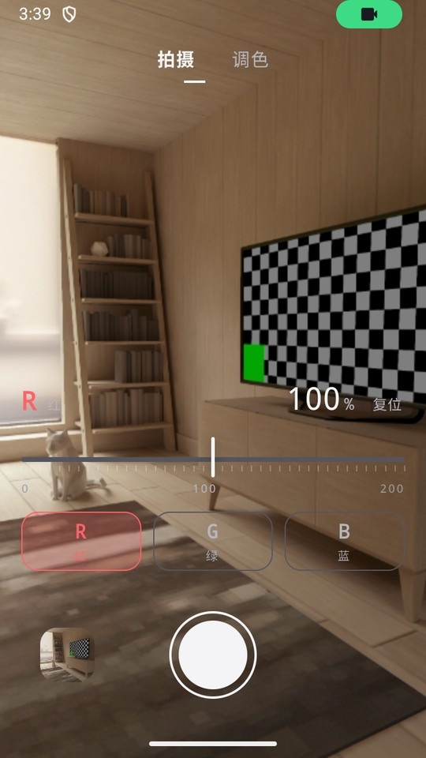
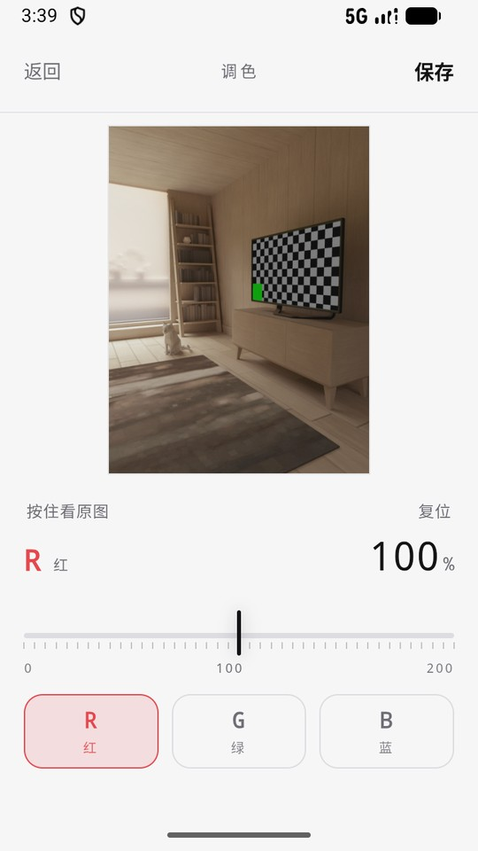
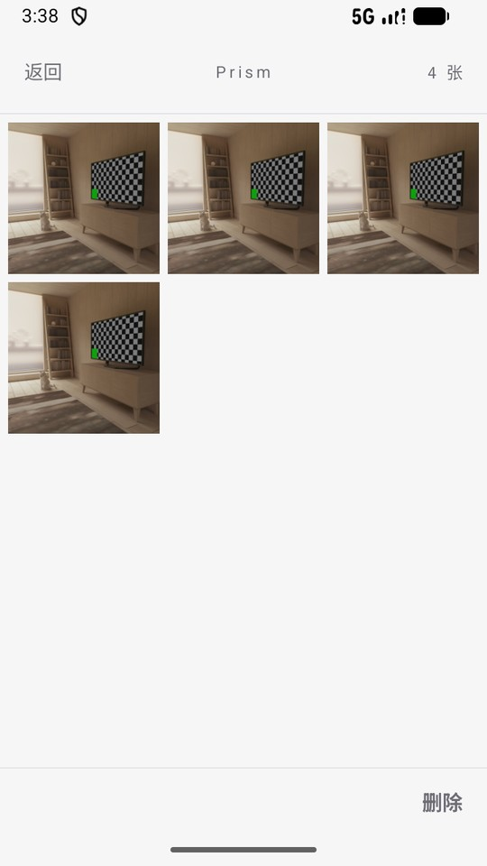

# Prism

给 Android 的极简拍照应用：**取景时就能单独调 R / G / B 三个通道的强度**，按下快门存下来的就是眼前看到的样子。

A minimal Android camera app with live per-channel (R/G/B) grading in the viewfinder.

<p align="center">
  
  
  
</p>

## 它解决哪件事

偏色往往是拍完才发现的——现场看着没问题，回相册才发现整体发绿。

Prism 把调色搬到取景时：拖动滑块压住任意通道，预览立刻跟着变；按快门时按同一套算法烘焙进照片。
预览什么样，存下来就是什么样。

## 怎么用

| 动作 | 结果 |
| --- | --- |
| 拖动取景页下方的滑块 | 实时调当前通道，范围 0–200%（100% = 原样），每 5% 一格 |
| 底部 `R` `G` `B` | 切换要调的通道；`复位` 只把当前通道放回 100% |
| 按快门 | 存进 `Pictures/Prism`，**留在取景继续拍**（三个通道的值不复位） |
| 点左下角缩略图 | 进相册 |
| 相册顶部标题 | 下拉切换系统分相册（`Prism` / `Camera` / `Screenshots` …，即系统怎么分的就怎么分） |
| 相册里单击一张 | 进调色页继续微调 |
| 相册里长按一张 | 进入多选；按住拖动是范围连选（斜着拖=起点到终点全选，往回拖=反选） |
| 调色页 `保存` | 弹出两项：另存为新照片 / 覆盖原图 |
| 长按快门 | 打开日志页（照片读不出来时用来留证据） |

## 界面细节

- **全自绘**：确认框、菜单、提示条都是应用自己画的，不用系统的 `AlertDialog` / `Toast`。
- **取景自适应**：相机页按取景亮度自动反色前景——暗场景配浅字、亮场景配深字，不在取景上盖任何色块。
- **切页动效**：默认左右平移；进相册和进调色页是从原位置放大、返回缩回原位（背景用旧页面快照，不会闪黑）。
- **启动页**：三个通道色水滴从顶部落下汇成图标，底部小字渐显，全程 1.4 秒。
- **删别人的照片**：删除或覆盖不是自己拍的照片时，Android 要求用户点头，系统会弹一次授权框。

## 构建

需要 JDK 17+ 和 Android SDK（`compileSdk 37`）。

```bash
git clone https://github.com/Offblink/Prism.git
cd Prism
./gradlew assembleDebug        # Windows: gradlew.bat assembleDebug
```

产物在 `app/build/outputs/apk/debug/app-debug.apk`，也可以直接用 Android Studio 打开跑。

## 权限

| 权限 | 用途 |
| --- | --- |
| `CAMERA` | 取景与拍照 |
| `READ_MEDIA_IMAGES`（Android 13+）<br>`READ_EXTERNAL_STORAGE`（Android 12 及以下） | 读取相册列表与缩略图 |
| `WRITE_EXTERNAL_STORAGE`（Android 9 及以下） | 老系统上写入 `Pictures/Prism` |

## 它做不到的

- 只有后摄；没有前摄、闪光灯、变焦——刻意做窄。
- 只在 API 37 的模拟器上实测过，真机未验。
- 拍的照片只进 `Pictures/Prism`；相册页能切到别的系统相册查看和编辑，但不会往那些目录里写。

## 代码结构

| 文件 | 职责 |
| --- | --- |
| `CameraActivity` | 取景、实时调色、拍摄；拍完留在本页 |
| `GalleryActivity` | 相册：系统分相册下拉、多选删除、缩略图缓存 |
| `EditorActivity` | 调色页：WebView 承载滑块，原生负责取图存图 |
| `assets/controls.html` `edit.html` | 滑块 UI，拍摄页与调色页共用一套 |
| `ChannelFilter` | 三通道乘法与 EXIF 摆正，预览与存图同一套数学 |
| `AlbumStore` | MediaStore 的唯一出入口（查、插、删、缩略图） |
| `Ui` / `DropLogoView` | 自绘交互件、缩放切页、启动页水滴动画 |

## 许可

[MIT](LICENSE)

调色的灵感出自 OpenCV 课程里通道分离与逐通道乘法那一节。
